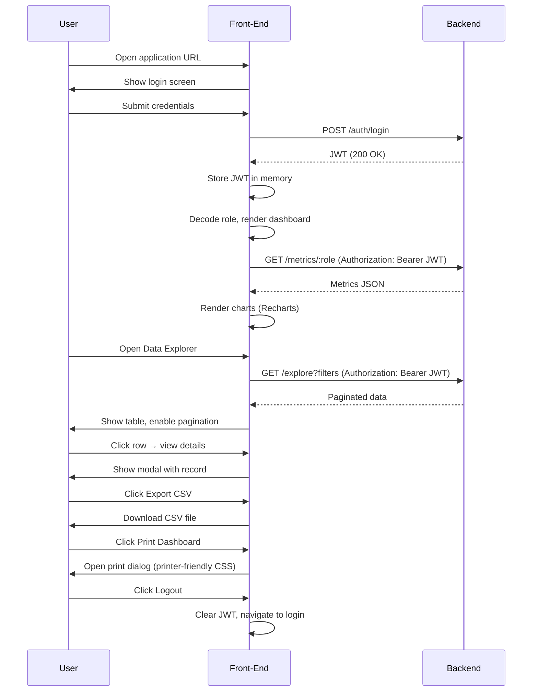
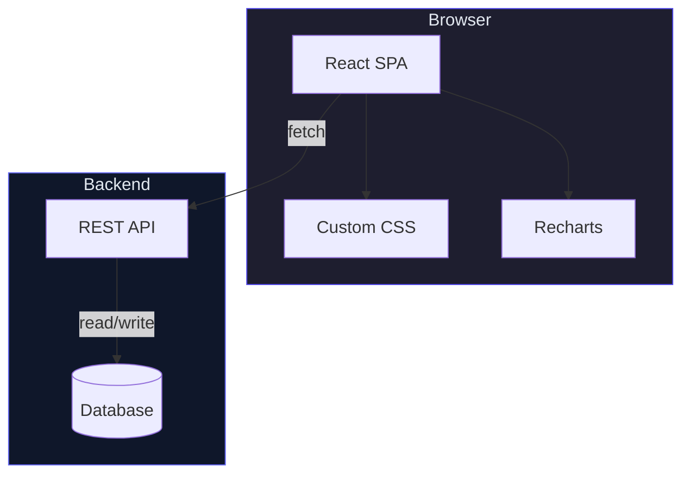
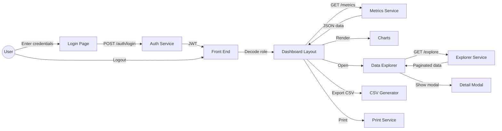

# Software Requirements Specification (SRS)
# CampusConnect Analytics – Extended Version

---

## Introduction
- Purpose: Define functional and non‑functional requirements for CampusConnect Analytics, a web‑based analytics platform for educational institutions.
- Scope: Single‑page React application styled with custom CSS, providing role‑based dashboards, interactive visualizations, and data export capabilities.
- Audience: Developers, testers, project managers, and stakeholders.

---

## Overall Description
- Product Perspective: Stand‑alone front‑end that consumes a RESTful backend API. All UI rendering, routing, and state management occur client‑side.
- Users & Roles:
  - Faculty – view class‑level metrics, risk badges, export reports.
  - Head of Department (HOD) – aggregate departmental statistics, filter by risk, explore data interactively.
  - Principal – campus‑wide KPIs, manage risk thresholds, generate executive summaries.
  - Guest – only sees login screen.
- Operating Environment: Modern browsers (Chrome, Edge, Firefox) on Windows, macOS, Linux. Network connection to backend API (CORS enabled).
- Constraints:
  - No Tailwind CSS – all styling via `src/index.css`.
  - React 19.x, Vite 8.x, Recharts 3.x locked in `package.json`.
  - JWT stored only in memory; never persisted to local storage.
  - Accessibility compliance with WCAG 2.1 AA.
- Assumptions:
  - Backend API reachable at `http://localhost:8000/api`.
  - Users have JavaScript enabled and a stable internet connection.

---

## Functional Overview (Core Functions)
- **Authentication** – login form validates email/password, obtains JWT, maintains session in memory.
- **Role‑Based Dashboard** – renders Faculty, HOD, or Principal dashboard based on JWT payload.
- **Data Visualization** – line, bar, and pie charts using Recharts; tooltips, drill‑down on click.
- **Interactive Data Explorer** – filter by date range, department, risk level; paginated result table; modal detail view.
- **Export & Print** – CSV export of chart data; printer‑friendly view for dashboard snapshot.
- **Responsive Design** – layout adapts for desktop and tablet viewports; hamburger menu on narrow screens.
- **Theming** – dark theme with glass‑morphism cards, gradient text, custom button styles.
- **Error Handling** – toast notifications for API failures; global error boundary logs unexpected errors.
- **Accessibility Features** – ARIA labels on interactive elements, keyboard navigation support, sufficient color contrast.

---

## Use Case Model
```mermaid
title CampusConnect Analytics – Use Cases

actor Faculty as F
actor HOD as H
actor Principal as P
actor Guest as G

usecase UC1 as "Login"
usecase UC2 as "View Faculty Dashboard"
usecase UC3 as "View HOD Dashboard"
usecase UC4 as "View Principal Dashboard"
usecase UC5 as "Explore Data"
usecase UC6 as "Export Chart Data"
usecase UC7 as "Print Dashboard"
usecase UC8 as "Logout"

G --> UC1
F --> UC1
H --> UC1
P --> UC1

F --> UC2
H --> UC3
P --> UC4

F --> UC5
H --> UC5
P --> UC5

F --> UC6
H --> UC6
P --> UC6

F --> UC7
H --> UC7
P --> UC7

F --> UC8
H --> UC8
P --> UC8
```

### Primary Use Cases (Brief Flow)
- **Login**
  - Guest enters credentials.
  - System validates via `/api/auth/login`.
  - On success, JWT stored in memory and user redirected to role‑specific dashboard.
- **View Dashboard**
  - System reads role from JWT.
  - Loads appropriate dashboard component.
  - Dashboard fetches metrics from `/api/metrics/:role` and renders charts.
- **Explore Data**
  - User selects filters (date, department, risk).
  - Debounced request to `/api/explore` returns paginated results.
  - Clicking a row opens a modal with detailed record.
- **Export Chart Data**
  - User clicks *Export CSV* button on a chart.
  - Client converts current chart data to CSV and triggers download.
- **Print Dashboard**
  - User clicks *Print* icon.
  - Printable stylesheet applied; browser print dialog opened.
- **Logout**
  - JWT cleared from memory; user returned to login page.

---

## System Workflow (Sequence Diagram)


---

## Detailed Functional Requirements (Bulleted)
- **Authentication**
  - Present login form with email and password fields.
  - Validate email format and password length (≥ 8).
  - POST credentials to `/api/auth/login`.
  - On success, receive JWT, store in a secure in‑memory variable.
  - Decode JWT to obtain user role; redirect to appropriate dashboard.
  - On failure, display user‑friendly error message.

- **Dashboard Rendering**
  - `<DashboardLayout>` component decides which child dashboard to render based on role.
  - Each dashboard fetches its own metric set from `/api/metrics/:role`.
  - Render charts inside `.glass-card` containers for visual consistency.
  - Show role badge and logout button in top navigation bar.

- **Charts and Visualizations**
  - Use Recharts components: `LineChart`, `BarChart`, `PieChart`.
  - Data points displayed with tooltips on hover.
  - Clicking a segment drills down to a detailed view (e.g., student‑level data).
  - Animations for chart entry and updates (smooth transitions).

- **Interactive Data Explorer**
  - Provide filter controls: date range picker, department dropdown, risk level selector.
  - Debounce filter changes (300 ms) before issuing API request.
  - Display results in a paginated table (20 rows per page).
  - Table rows are clickable; clicking opens a modal with complete record details.
  - Allow sorting by column headers.

- **Export & Print**
  - *Export CSV* button on each chart converts chart data to CSV format and triggers download.
  - *Print Dashboard* button switches to printer‑friendly CSS (high‑contrast, no animations) and opens browser print dialog.

- **Responsive Layout**
  - Use CSS media queries to switch to a single‑column layout below 768 px.
  - Collapse side navigation into a hamburger menu on narrow screens.
  - Ensure charts resize fluidly to container width.

- **Theming & Styling**
  - Global dark background (`#020617`) and primary brand color (`#4f46e5`).
  - Reusable CSS classes defined in `src/index.css`:
    - `.glass-card` – translucent background with blur, border, shadow.
    - `.btn-primary` – gradient background, rounded corners, hover/active states.
    - `.badge-risk-high`, `.badge-risk-medium`, `.badge-risk-low` – colored risk indicators.
    - `.gradient-text` – gradient‑filled text using `background-clip`.

- **Accessibility**
  - All buttons and interactive elements include `aria-label` attributes.
  - Keyboard navigation: focus order logical, `Enter` activates buttons.
  - Contrast ratios meet ≥ 4.5:1 for normal text, ≥ 3:1 for large text.
  - Provide skip‑to‑content link at top of the page.

- **Error Handling & Logging**
  - API errors display toast notification with concise message.
  - Global error boundary catches uncaught JavaScript exceptions and logs stack trace to console.
  - Network failures prompt user to retry or check connection.

---

## Non‑Functional Requirements (Bulleted)
- **Performance**
  - Initial bundle size ≤ 2 MB; first paint within 2 seconds on a 10 Mbps connection.
  - API response latency ≤ 500 ms for metric endpoints (95 % percentile).
  - Chart rendering for ≤ 500 data points completes within 200 ms.

- **Security**
  - JWT stored only in memory; cleared on logout or page refresh.
  - All API calls over HTTPS in production.
  - Content‑Security‑Policy restricts script sources to self and trusted CDNs.
  - Rate‑limit login attempts (5 per minute per IP).

- **Usability**
  - First‑time user can log in and view a dashboard within 2 minutes of onboarding.
  - Tooltips and help icons available on complex charts.
  - Consistent use of Google Font **Inter** for all text.

- **Reliability**
  - Front‑end served with `Cache‑Control: no‑store` during development; `max‑age=86400` in production.
  - Client‑side error boundaries prevent full app crash on component failure.

- **Maintainability**
  - Source tree under `/src` with clearly separated folders for `components`, `context`, `assets`, `styles`.
  - All custom CSS classes documented with comments in `src/index.css`.
  - Linting enforced via **oxlint**; CI fails on lint errors.

- **Portability**
  - Works on Windows, macOS, Linux without OS‑specific code.
  - No file‑system paths hard‑coded; only relative imports.

---

## System Architecture Diagram


---

## Data Flow Diagram (Level 1)


---

## Glossary
- **JWT** – JSON Web Token used for stateless authentication.
- **Glass‑morphism** – UI design pattern with translucent backgrounds and blur effects.
- **Risk Badge** – Visual label indicating low/medium/high risk status.
- **CSP** – Content Security Policy header.
- **Toast** – Small transient notification displayed on the screen.

---

## Revision History
- **Version 1.0** – 2026‑08‑24 – Initial extended SRS with use case diagrams, workflow, and functions.

---

*End of Document*
